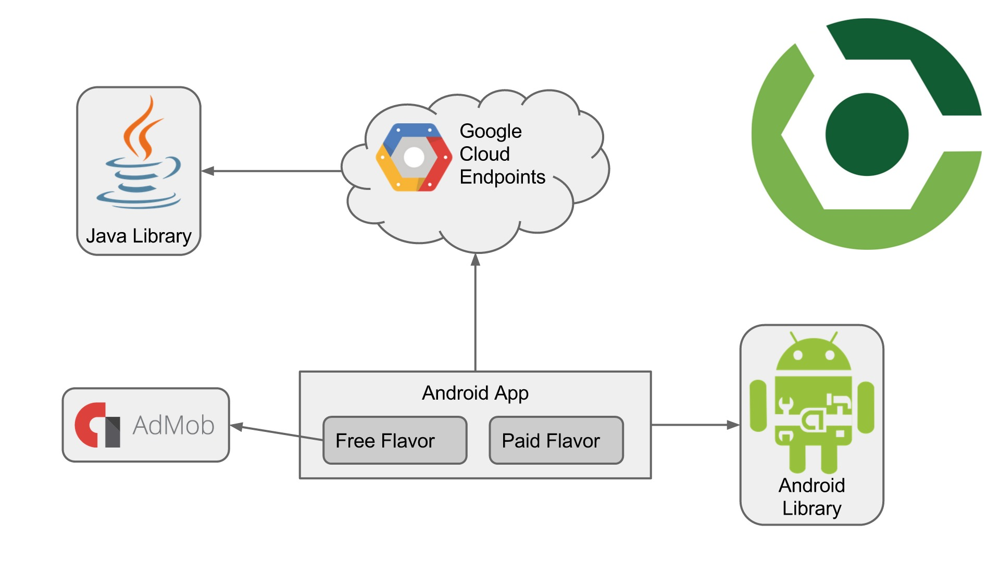
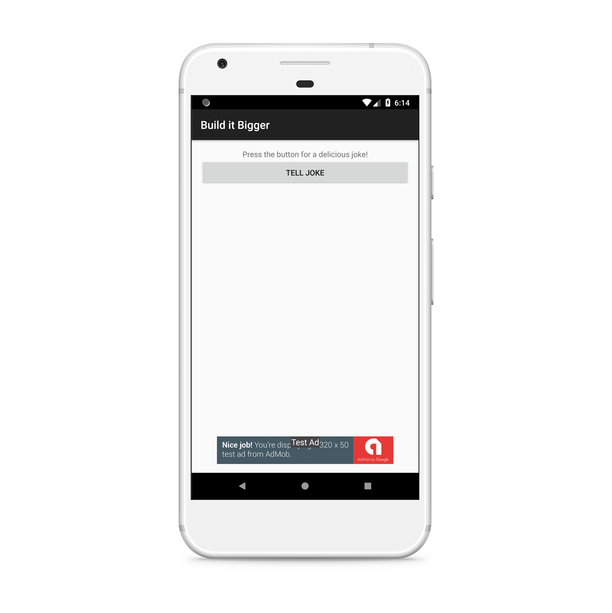
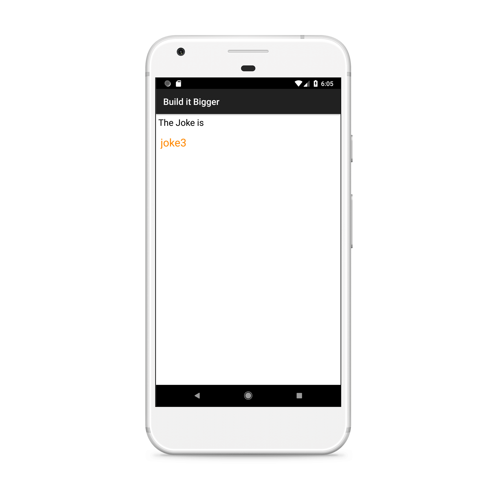
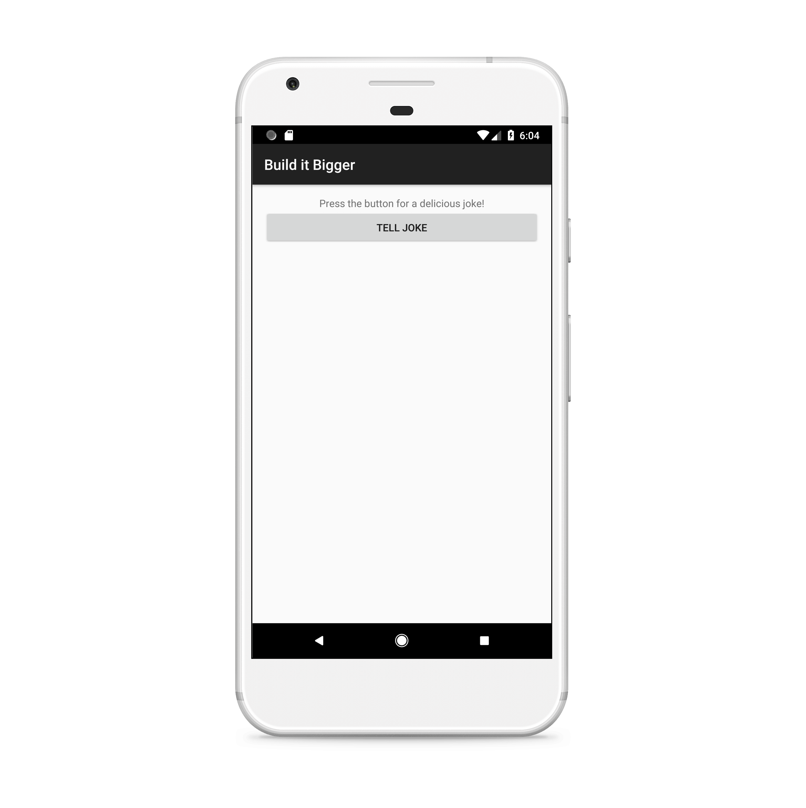

# Joking teller App 
Android developer nanodegree: Project 2

## Project Overview
In this project, you will create an app with multiple flavors that uses multiple libraries and Google Cloud Endpoints. The finished app will consist of four modules:

- A Java library that provides jokes
- A Google Cloud Endpoints (GCE) project that serves those jokes
- An Android Library containing an activity for displaying jokes
- An Android app that fetches jokes from the GCE module and passes them to the Android Library for display

## Why this Project?
As Android projects grow in complexity, it becomes necessary to customize the behavior of the Gradle build tool, allowing automation of repetitive tasks. Particularly, factoring functionality into libraries and creating product flavors allow for much bigger projects with minimal added complexity.

## What Will I Learn?
You will learn the role of Gradle in building Android Apps and how to use Gradle to manage apps of increasing complexity. You'll learn to:
- Add free and paid flavors to an app, and set up your build to share code between them
- Factor reusable functionality into a Java library
- Factor reusable Android functionality into an Android library
- Configure a multi project build to compile your libraries and app
- Use the Gradle App Engine plugin to deploy a backend
- Configure an integration test suite that runs against the local App Engine development server
- In this project you will:

## App Description
Your task is to create a Android Baking App that will allow Udacity’s resident baker-in-chief, Miriam, to share her recipes with the world. You will create an app that will allow a user to select a recipe and see video-guided steps for how to complete it.

The JSON file [here](https://d17h27t6h515a5.cloudfront.net/topher/2017/May/59121517_baking/baking.json) contains the recipes' instructions, ingredients, videos and images you will need to complete this project. Don’t assume that all steps of the recipe have a video. Some may have a video, an image, or no visual media at all.
One of the skills you will demonstrate in this project is how to handle unexpected input in your data -- professional developers often cannot expect polished JSON data when building an app.

## Rubric
### General App Usage
 - App should display recipes from provided network resource.
 - App should allow navigation between individual recipes and recipe steps.
 - App uses RecyclerView and can handle recipe steps that include videos or images.
 - App conforms to common standards found in the Android Nanodegree General Project Guidelines.

### Components and Libraries
 - Application uses Master Detail Flow to display recipe steps and navigation between them.
 - Application uses Exoplayer to display videos.
 - Application properly initializes and releases video assets when appropriate.
 - Application should properly retrieve media assets from the provided network links. It should properly handle network requests.
 - Application makes use of Espresso to test aspects of the UI.
 - Application sensibly utilizes a third-party library to enhance the app's features. That could be helper library to interface with Content Providers if you choose to store the recipes, a UI binding library to avoid writing findViewById a bunch of times, or something similar.

## Screenshots
Free version (with ads)

Paid version 

Random Joke displayed

*Build it bigger app was highly evaluated by certified Udacity code reviewer and was graded as "Exceeds Specifications".*
 
 
# Android Developer Nanodegree

